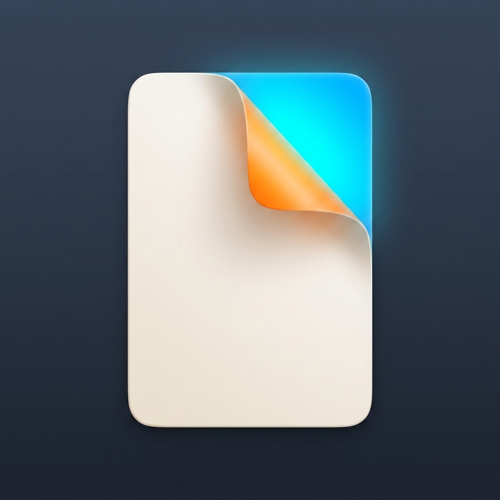
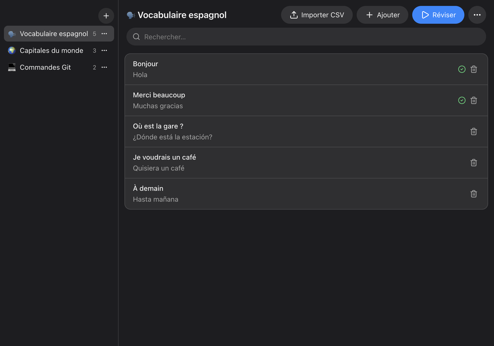
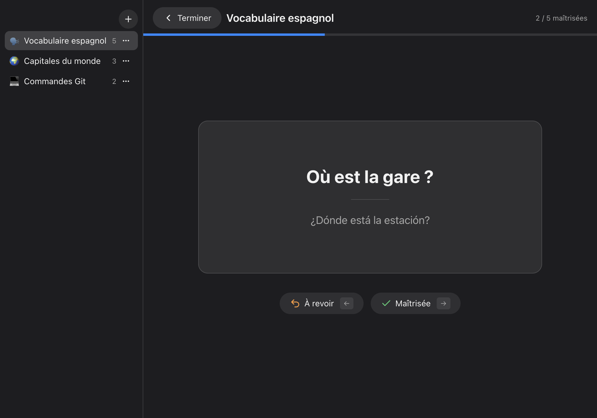

<div align="center">
  

  # FlashCard

  **Anki, but simpler. Flashcards for macOS with zero setup.**

  No account, no cloud, no scheduler to configure — your cards stay on your Mac.
  Entirely vibe-coded with [Claude Code](https://claude.com/claude-code). macOS only.

  
  
  
</div>

| Your collections | Review session |
|---|---|
|  |  |

## Features

- **Keyboard-first reviews**: `Space` reveals the answer, `→` mastered, `←` again, `Esc` ends the session
- **Spaced repetition**: cards come back until mastered; progress persists between sessions
- **CSV import** (`front,back`): delimiter and header row detected automatically
- **Native feel**: vibrancy window, automatic dark mode, emoji collection icons

## Install

```sh
brew tap allisterk2703/tap
brew trust allisterk2703/tap
brew install --cask flashcard
```

> The app is not notarized. If macOS blocks the first launch, right-click → **Open**,
> or run `xattr -dr com.apple.quarantine /Applications/FlashCard.app`.

Also available as `.dmg` / `.zip` from the [releases](https://github.com/allisterk2703/flashcard/releases/latest), or from source: `npm install && npm start`.

## License

[MIT](LICENSE) © Allister Kohn — built with Electron, React 19, Tailwind CSS 4 and Radix UI.
